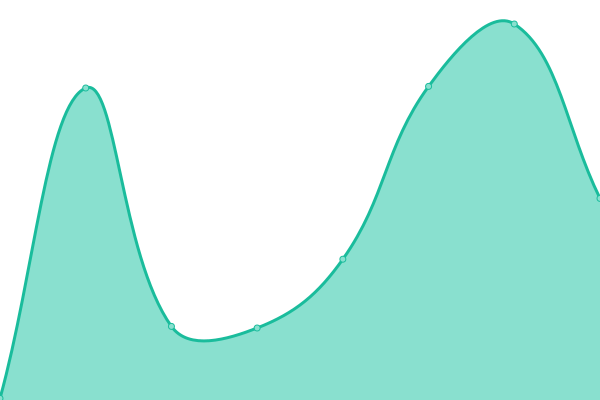

# [📈 Live Status](https://fachinformatiker.github.io/upptime): <!--live status--> **🟧 Partial outage**

This repository contains the open-source uptime monitor and status page for [Patrick Szalewicz](https://psvisual.de), powered by [Upptime](https://github.com/upptime/upptime).

With [Upptime](https://upptime.js.org), you can get your own unlimited and free uptime monitor and status page, powered entirely by a GitHub repository. We use [Issues](https://github.com/fachinformatiker/upptime/issues) as incident reports, [Actions](https://github.com/fachinformatiker/upptime/actions) as uptime monitors, and [Pages](https://fachinformatiker.github.io/upptime) for the status page.

<!--start: status pages-->
<!-- This summary is generated by Upptime (https://github.com/upptime/upptime) -->
<!-- Do not edit this manually, your changes will be overwritten -->
<!-- prettier-ignore -->
| URL | Status | History | Response Time | Uptime |
| --- | ------ | ------- | ------------- | ------ |
|  [Psvisual](https://psvisual.de) | 🟩 Up | [psvisual.yml](https://github.com/fachinformatiker/upptime/commits/HEAD/history/psvisual.yml) | 

 1830ms
     
 | 

<a href="https://fachinformatiker.github.io/upptime/history/psvisual">99.85%</a>
    

|  [Opieka z pasja](https://opiekazpasja.pl) | 🟩 Up | [opieka-z-pasja.yml](https://github.com/fachinformatiker/upptime/commits/HEAD/history/opieka-z-pasja.yml) | 

 1515ms
     
 | 

<a href="https://fachinformatiker.github.io/upptime/history/opieka-z-pasja">100.00%</a>
    

|  [Annielovelifemusic](https://annielovelifemusic.de) | 🟩 Up | [annielovelifemusic.yml](https://github.com/fachinformatiker/upptime/commits/HEAD/history/annielovelifemusic.yml) | 

 1921ms
     
 | 

<a href="https://fachinformatiker.github.io/upptime/history/annielovelifemusic">100.00%</a>
    

|  [016969.xyz](https://016969.xyz) | 🟥 Down | [016969-xyz.yml](https://github.com/fachinformatiker/upptime/commits/HEAD/history/016969-xyz.yml) | 

 0ms
     
 | 

<a href="https://fachinformatiker.github.io/upptime/history/016969-xyz">100.00%</a>
    

|  [JNB Media](https://jnbmedia.de) | 🟩 Up | [jnb-media.yml](https://github.com/fachinformatiker/upptime/commits/HEAD/history/jnb-media.yml) | 

 931ms
     
 | 

<a href="https://fachinformatiker.github.io/upptime/history/jnb-media">100.00%</a>
    

|  [Google](https://www.google.com) | 🟩 Up | [google.yml](https://github.com/fachinformatiker/upptime/commits/HEAD/history/google.yml) | 

 94ms
     
 | 

<a href="https://fachinformatiker.github.io/upptime/history/google">100.00%</a>
    

|  [Wikipedia](https://en.wikipedia.org) | 🟩 Up | [wikipedia.yml](https://github.com/fachinformatiker/upptime/commits/HEAD/history/wikipedia.yml) | 

 235ms
     
 | 

<a href="https://fachinformatiker.github.io/upptime/history/wikipedia">100.00%</a>
    

|  [Hacker News](https://news.ycombinator.com) | 🟩 Up | [hacker-news.yml](https://github.com/fachinformatiker/upptime/commits/HEAD/history/hacker-news.yml) | 

 292ms
     
 | 

<a href="https://fachinformatiker.github.io/upptime/history/hacker-news">100.00%</a>
    

|  [IPv6 test](forwardemail.net) | 🟥 Down | [i-pv6-test.yml](https://github.com/fachinformatiker/upptime/commits/HEAD/history/i-pv6-test.yml) | 

 0ms
     
 | 

<a href="https://fachinformatiker.github.io/upptime/history/i-pv6-test">100.00%</a>
    

<!--end: status pages-->

[**Visit our status website →**](https://fachinformatiker.github.io/upptime)

## 📄 License

- Powered by: [Upptime](https://github.com/upptime/upptime)
- Code: [MIT](./LICENSE) © [Anand Chowdhary](https://anandchowdhary.com), supported by [Pabio](https://pabio.com)
- Data in the `./history` directory: [Open Database License](https://opendatacommons.org/licenses/odbl/1-0/)
